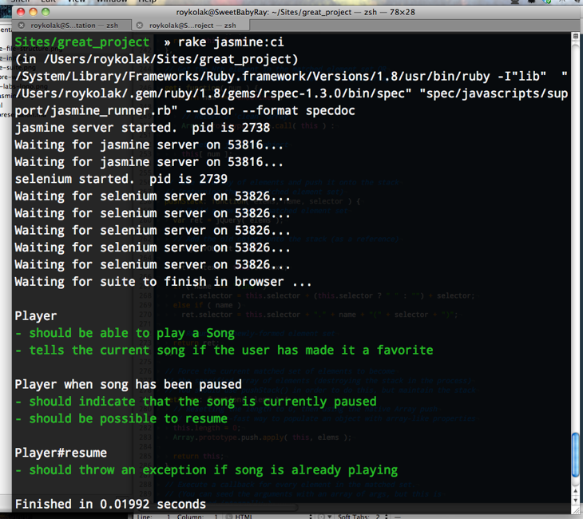

!SLIDE

!SLIDE

### Javascript is madly in love with Testing.

!SLIDE

# Ready?

!SLIDE

## Screw unit

!SLIDE

## Blue Ridge

!SLIDE

## JSpec

!SLIDE

## QUnit

!SLIDE

## JSUnit

!SLIDE

## JSTest

!SLIDE

## Unitesting

!SLIDE

## YUI Test

!SLIDE

## jsUnitTest

!SLIDE

## Vows

!SLIDE

## Jasmine

!SLIDE

# History

!SLIDE

!SLIDE

!SLIDE

## 4 of the 18 launch apps

!SLIDE

!SLIDE

#### Screw unit
#### Blue Ridge
#### JSpec
#### QUnit
#### JSUnit
#### JSTest
#### Unitesting
#### YUI Test
#### jsUnitTest

!SLIDE

* Support for asynchronous specs
* No dependency on frameworks
* No dependency on request/response cycle

!SLIDE

## Enter Jasmine

!SLIDE

## Developers missed Jasmine

!SLIDE

# Code

!SLIDE

!SLIDE

!SLIDE

@@@ js
    describe('Array', function() {
      var array;
      
      describe('#unique', function() {
        beforeEach(function() {
          array = [3,3,4];
        });
        
        it("returns only the unique values in the array", function() {
          expect(array.unique()).toEqual([3,4]);
        });
      });
    });
@@@

!SLIDE

@@@ js
    describe('Array', function() {
      var array;
      
      describe('#unique', function() {
        beforeEach(function() {
          array = [3,3,4];
        });
        
        xit("returns only the unique values in the array", function() {
          expect(array.unique()).toEqual([3,4]);
        });
      });
    });
@@@

!SLIDE

@@@ js
    expect(x).toEqual(y);

    expect(x).toMatch(pattern);

    expect(x).toBeDefined();

    expect(x).toBeNull();

    expect(x).toBeTruthy();

    expect(x).toBeFalsy();

    expect(x).toContain(y);

    expect(x).not.toEqual(y);
@@@

!SLIDE

## Not mocks and Stubs
# Spies

!SLIDE

@@@ js
    function BetterArray(array) {
      this.array = array;
    }
    
    BetterArray.prototype = {
      joinify: function() {
        
        ... // Does some cool stuff
        
        this.array = this.array.join('.');
      }
    }
@@@

!SLIDE

@@@ js
    describe('BetterArray', function() {
      var betterArray, anArray = [3,3,4];
      
      beforeEach(function() {
        betterArray = new BetterArray(anArray);
      });
      
      describe('#joinify', function() {
        it("calls the standard join method on Array", function() {
          var joinSpy = spyOn(betterArray.array, 'join');
          betterArray.joinify();
          expect(joinSpy).toHaveBeenCalled();
        });
      });
    });
@@@

!SLIDE

@@@ js
    var methodSpy = spyOn(instance, 'method');
    ...
    
    expect(methodSpy).toHaveBeenCalled();
    
    expect(methodSpy).toHaveBeenCalledWith('turkey legs');
    
    expect(methodSpy).toHaveBeenCalledWith(4, 6, "mexican standoff");
    
    expect(methodSpy).not.toHaveBeenCalled();
    
    expect(methodSpy.callCount).toEqual(5)
@@@

!SLIDE

@@@ js
    var methodSpy = spyOn(instance, 'method').andCallThrough();
    
    var methodSpy = spyOn(instance, 'method').andReturn("Banana Republic");
    
    var methodSpy = spyOn(instance, 'method').andThrow("Shit pancakes");
    
    var methodSpy = spyOn(instance, 'method').andCallFake(function() {
      goTellSomeoneElse();
    });
@@@

!SLIDE

## A real world Spy

!SLIDE

@@@ js
    describe("ExpandCollapse", function() {
      var id = 'id', expandCollapse;
  
      beforeEach(function() {
        expandCollapse = new ExpandCollapse(id);
      });
  
      describe("#attachBehavior", function() {
        it("attaches a click to the handle", function() {
          var clickSpy = spyOn($.fn, 'click');
          expandCollapse.attachBehavior();
          expect(clickSpy).wasCalled();
        });
      });
    });
@@@

!SLIDE

# Running

!SLIDE

!SLIDE

!SLIDE

!SLIDE

## Questions?

!SLIDE

# Development environment

!SLIDE

## Got to be fast.

## Autospec like.

## Easy results.

!SLIDE

## Headless spec runner.
# Jazz_money

!SLIDE

!SLIDE

@@@ ruby

    require 'rubygems'
    require 'jazz_money'
    require 'yaml'

    code = []
    specs = []

    jasmine_yml = File.open('spec/javascripts/support/jasmine.yml')
    config = YAML::load_stream(jasmine_yml).documents[0]

    ... # parse jasmine config file to get code and specs to run

    JazzMoney::Runner.new(code, specs).call

@@@

!SLIDE

@@@ ruby 
    namespace :jasmine do
      desc "Run specs via commandline"
      task :headless do
        system("ruby spec/javascripts/support/jazz_money_runner.rb")
      end
    end
    
    # rake jasmine:headless
@@@

!SLIDE

!SLIDE

## Watch files, runs code.
# Watchr

!SLIDE

@@@ ruby
    require 'growl'

    watch( 'spec/javascripts/.*\.js' )  {|md| run() }
    watch( 'public/javascript/.*\.js' )  {|md| run() }

    def run
      result = `rake jasmine:headless`
      puts(result)
      growl(result) # Next
    end
@@@

!SLIDE

## Result notifications.
# Growl

!SLIDE

@@@ ruby 
    def growl(result)
      time = result.match(/Finished in ([0-9]*\.?[0-9]+) seconds?/)[0]
      examples = result.match(/([0-9]*\.?[0-9]+) examples?/)[0]
      failures = result.match(/([0-9]*\.?[0-9]+) failures?/)[0]
  
      message = "#{examples}\n#{time}"
  
      if(result.include?('0 failures'))
        Growl.notify_ok(message, :sticky => false, :title => failures)
      else
        Growl.notify_error(message, :sticky => false, :title => failures)
      end
    end
@@@

!SLIDE

# Result

!SLIDE

@@@ js
    watchr javascript.watchr
@@@

!SLIDE

!SLIDE

!SLIDE

## Questions?

!SLIDE

* [http://groups.google.com/group/jasmine-js](http://groups.google.com/group/jasmine-js)
* [http://github.com/pivotal/jasmine](http://github.com/pivotal/jasmine)
* [http://pivotal.github.com/jasmine/](http://pivotal.github.com/jasmine/)